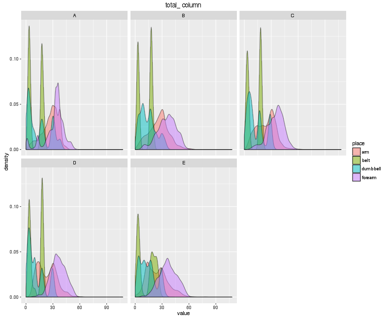
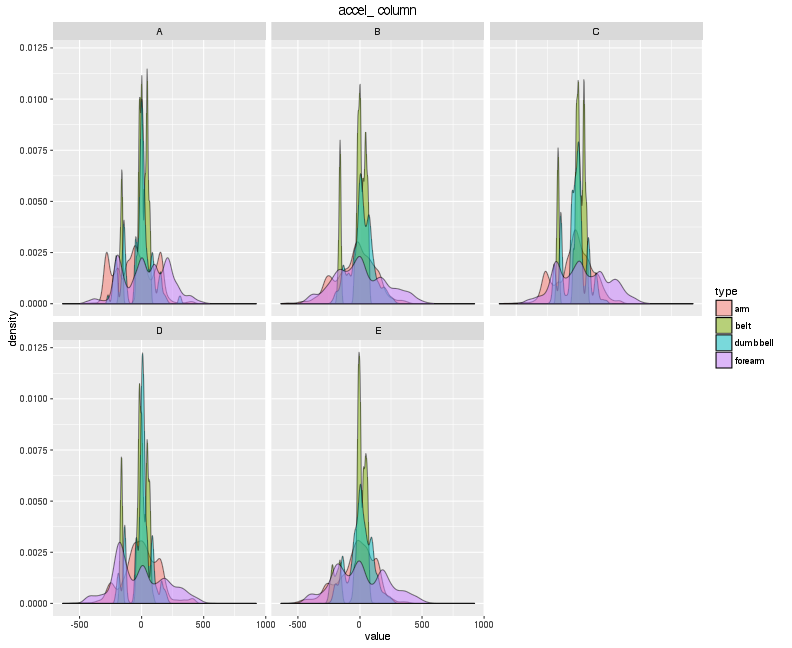
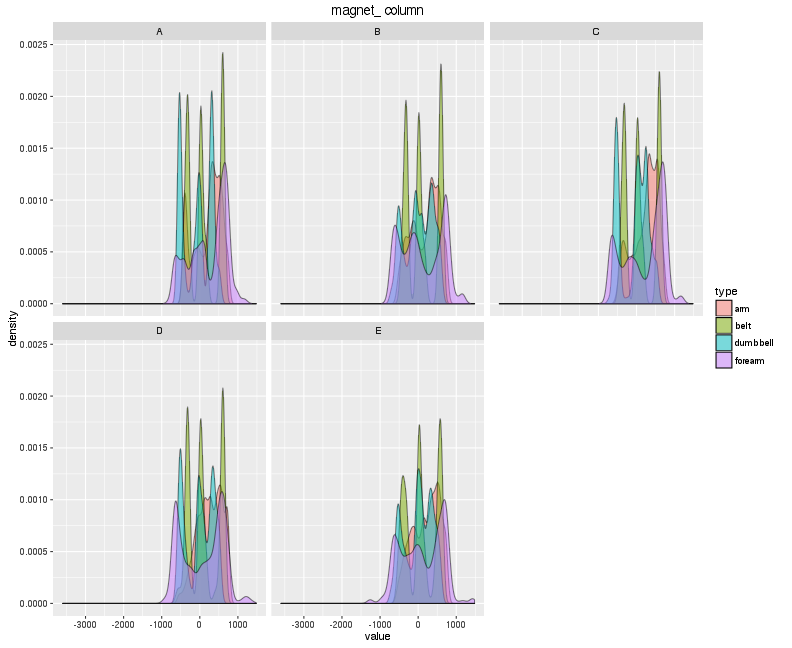
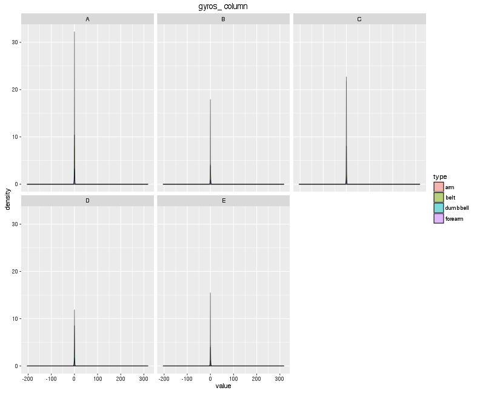
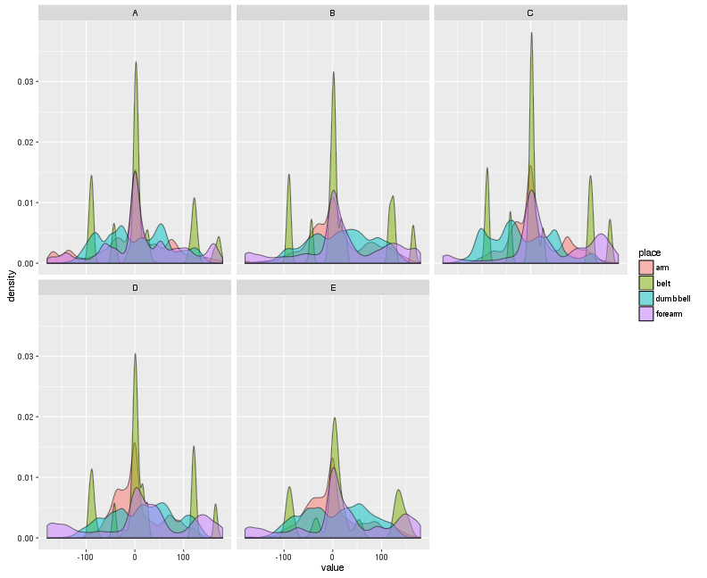

* Author: Lorena Pantano Rubino
* Project: Predict how well an exercise is done using data from accelerometers on the belt, forearm, arm, and dumbell of 6 participant


Link to the initial information: http://groupware.les.inf.puc-rio.br/har


## Data inspection

First step is to understand the data. How many variables, distribution, NAs values ...etc

The table has 19622, 159 rows and columns. Let's see the names of the columns
to have an idea of what they are.


```
  [1] "user_name"                "raw_timestamp_part_1"    
  [3] "raw_timestamp_part_2"     "cvtd_timestamp"          
  [5] "new_window"               "num_window"              
  [7] "roll_belt"                "pitch_belt"              
  [9] "yaw_belt"                 "total_accel_belt"        
 [11] "kurtosis_roll_belt"       "kurtosis_picth_belt"     
 [13] "kurtosis_yaw_belt"        "skewness_roll_belt"      
 [15] "skewness_roll_belt.1"     "skewness_yaw_belt"       
 [17] "max_roll_belt"            "max_picth_belt"          
 [19] "max_yaw_belt"             "min_roll_belt"           
 [21] "min_pitch_belt"           "min_yaw_belt"            
 [23] "amplitude_roll_belt"      "amplitude_pitch_belt"    
 [25] "amplitude_yaw_belt"       "var_total_accel_belt"    
 [27] "avg_roll_belt"            "stddev_roll_belt"        
 [29] "var_roll_belt"            "avg_pitch_belt"          
 [31] "stddev_pitch_belt"        "var_pitch_belt"          
 [33] "avg_yaw_belt"             "stddev_yaw_belt"         
 [35] "var_yaw_belt"             "gyros_belt_x"            
 [37] "gyros_belt_y"             "gyros_belt_z"            
 [39] "accel_belt_x"             "accel_belt_y"            
 [41] "accel_belt_z"             "magnet_belt_x"           
 [43] "magnet_belt_y"            "magnet_belt_z"           
 [45] "roll_arm"                 "pitch_arm"               
 [47] "yaw_arm"                  "total_accel_arm"         
 [49] "var_accel_arm"            "avg_roll_arm"            
 [51] "stddev_roll_arm"          "var_roll_arm"            
 [53] "avg_pitch_arm"            "stddev_pitch_arm"        
 [55] "var_pitch_arm"            "avg_yaw_arm"             
 [57] "stddev_yaw_arm"           "var_yaw_arm"             
 [59] "gyros_arm_x"              "gyros_arm_y"             
 [61] "gyros_arm_z"              "accel_arm_x"             
 [63] "accel_arm_y"              "accel_arm_z"             
 [65] "magnet_arm_x"             "magnet_arm_y"            
 [67] "magnet_arm_z"             "kurtosis_roll_arm"       
 [69] "kurtosis_picth_arm"       "kurtosis_yaw_arm"        
 [71] "skewness_roll_arm"        "skewness_pitch_arm"      
 [73] "skewness_yaw_arm"         "max_roll_arm"            
 [75] "max_picth_arm"            "max_yaw_arm"             
 [77] "min_roll_arm"             "min_pitch_arm"           
 [79] "min_yaw_arm"              "amplitude_roll_arm"      
 [81] "amplitude_pitch_arm"      "amplitude_yaw_arm"       
 [83] "roll_dumbbell"            "pitch_dumbbell"          
 [85] "yaw_dumbbell"             "kurtosis_roll_dumbbell"  
 [87] "kurtosis_picth_dumbbell"  "kurtosis_yaw_dumbbell"   
 [89] "skewness_roll_dumbbell"   "skewness_pitch_dumbbell" 
 [91] "skewness_yaw_dumbbell"    "max_roll_dumbbell"       
 [93] "max_picth_dumbbell"       "max_yaw_dumbbell"        
 [95] "min_roll_dumbbell"        "min_pitch_dumbbell"      
 [97] "min_yaw_dumbbell"         "amplitude_roll_dumbbell" 
 [99] "amplitude_pitch_dumbbell" "amplitude_yaw_dumbbell"  
[101] "total_accel_dumbbell"     "var_accel_dumbbell"      
[103] "avg_roll_dumbbell"        "stddev_roll_dumbbell"    
[105] "var_roll_dumbbell"        "avg_pitch_dumbbell"      
[107] "stddev_pitch_dumbbell"    "var_pitch_dumbbell"      
[109] "avg_yaw_dumbbell"         "stddev_yaw_dumbbell"     
[111] "var_yaw_dumbbell"         "gyros_dumbbell_x"        
[113] "gyros_dumbbell_y"         "gyros_dumbbell_z"        
[115] "accel_dumbbell_x"         "accel_dumbbell_y"        
[117] "accel_dumbbell_z"         "magnet_dumbbell_x"       
[119] "magnet_dumbbell_y"        "magnet_dumbbell_z"       
[121] "roll_forearm"             "pitch_forearm"           
[123] "yaw_forearm"              "kurtosis_roll_forearm"   
[125] "kurtosis_picth_forearm"   "kurtosis_yaw_forearm"    
[127] "skewness_roll_forearm"    "skewness_pitch_forearm"  
[129] "skewness_yaw_forearm"     "max_roll_forearm"        
[131] "max_picth_forearm"        "max_yaw_forearm"         
[133] "min_roll_forearm"         "min_pitch_forearm"       
[135] "min_yaw_forearm"          "amplitude_roll_forearm"  
[137] "amplitude_pitch_forearm"  "amplitude_yaw_forearm"   
[139] "total_accel_forearm"      "var_accel_forearm"       
[141] "avg_roll_forearm"         "stddev_roll_forearm"     
[143] "var_roll_forearm"         "avg_pitch_forearm"       
[145] "stddev_pitch_forearm"     "var_pitch_forearm"       
[147] "avg_yaw_forearm"          "stddev_yaw_forearm"      
[149] "var_yaw_forearm"          "gyros_forearm_x"         
[151] "gyros_forearm_y"          "gyros_forearm_z"         
[153] "accel_forearm_x"          "accel_forearm_y"         
[155] "accel_forearm_z"          "magnet_forearm_x"        
[157] "magnet_forearm_y"         "magnet_forearm_z"        
[159] "classe"                  
```

There is a lot of information here. It seems there are 3 different gadgets to
read position and movement. Then, the 4 different location in the body, as
the web page described.

Something interesting is to know how many users there are: carlitos, pedro, adelmo, charles, eurico, jeremy.
Note that this model will be very biased to these users. It's not a big 
representation to predict for any other person.

There is the values of `new` windows, and it seems every time there is 
a new windows, there is all these variables summarizing that window:
skewness, kurtosis, average, variation ... etc.

I will remove these rows, since they are summarization of the others, 
and the others have NA values for these columns.


After that, we work with `dim(clean_train)[2]` columns. Still a little confuse
to understand the data, but if we select only one place (`forearm`), let's
see the how many variables we have for that:


```
 [1] "roll_forearm"        "pitch_forearm"       "yaw_forearm"        
 [4] "total_accel_forearm" "gyros_forearm_x"     "gyros_forearm_y"    
 [7] "gyros_forearm_z"     "accel_forearm_x"     "accel_forearm_y"    
[10] "accel_forearm_z"     "magnet_forearm_x"    "magnet_forearm_y"   
[13] "magnet_forearm_z"   
```

That's help. The next step is to see the distribution values.

## Data description

I would like to see the distribution and some way the correlation with the
variable `classe`. I will show figures for `accel`, `magnet`, `gyros` and `total`
columns for each position and gadget.

For curiosity, want to check if all different classes are equally represented:


```

   A    B    C    D    E 
5471 3718 3352 3147 3528 
```

That's good, because shouldn't be super bias to any of them.




First, numbers are different between all variables we have here, so we would need
to preProcess the data, maybe scaling is enough.

But there is simpler data, only the values for each gadget and position may be
enough for this prediction. This is the relationship between theese columns
and the classes.



There are some clear difference from different positions, for sure
these variables seem important.


**Note**: each of the different gadgets have very different values
and the previous figure doesn't show that, but the result is the same.
There are different patterns as well.

## Model

I will train the data with **random forest** because it can handle all 
these columns, there are many rows, and it seemed to work pretty 
well during the course.

**cross-validation** was done subsampling the training table into two datasets:
75% used to train the model, 25% to test the mode and to calculate the real error.


As predictor, I will use only the ones from the previous figure: the basic
information from the gadgets: roll_belt, pitch_belt, yaw_belt, roll_arm, pitch_arm, yaw_arm, roll_dumbbell, pitch_dumbbell, yaw_dumbbell, roll_forearm, pitch_forearm, yaw_forearm, classe.

I will scale the predictors since they have very different values.
What I would do in a longer analysis, it would be to create a validation data set to decide
what is the best transformation, or even what columns to use, or model.

This is the confusionMatrix:


```

Call:
 randomForest(x = x, y = y, mtry = param$mtry) 
               Type of random forest: classification
                     Number of trees: 500
No. of variables tried at each split: 7

        OOB estimate of  error rate: 1.16%
Confusion matrix:
     A    B    C    D    E class.error
A 4088   12    0    2    2 0.003898635
B   17 2727   42    2    1 0.022230190
C    0   19 2474   19    2 0.015910899
D    1    3   17 2338    2 0.009741635
E    0    7   11    8 2620 0.009826153
```

We got a good accuracy. Even it seems it's over-fitting.

The expected **out-sample-error** is very low. According to the model the error
is 2%. 

Comparing with the test data we can estimate better this error:


```
Confusion Matrix and Statistics

          Reference
Prediction    A    B    C    D    E
         A 1365    8    0    1    0
         B    2  910    4    3    3
         C    0    9  827    6    2
         D    0    2    6  776    3
         E    0    0    1    0  874

Overall Statistics
                                          
               Accuracy : 0.9896          
                 95% CI : (0.9863, 0.9923)
    No Information Rate : 0.2847          
    P-Value [Acc > NIR] : < 2.2e-16       
                                          
                  Kappa : 0.9868          
 Mcnemar's Test P-Value : NA              

Statistics by Class:

                     Class: A Class: B Class: C Class: D Class: E
Sensitivity            0.9985   0.9795   0.9869   0.9873   0.9909
Specificity            0.9974   0.9969   0.9957   0.9973   0.9997
Pos Pred Value         0.9934   0.9870   0.9799   0.9860   0.9989
Neg Pred Value         0.9994   0.9951   0.9972   0.9975   0.9980
Prevalence             0.2847   0.1935   0.1745   0.1637   0.1837
Detection Rate         0.2843   0.1895   0.1722   0.1616   0.1820
Detection Prevalence   0.2861   0.1920   0.1758   0.1639   0.1822
Balanced Accuracy      0.9980   0.9882   0.9913   0.9923   0.9953
```

When using the test data to calculate it, it showed 1.37% of mis-clasification.
Then we expect none or one wrong prediction in the test data we have to submit for the course.

Probably using the 52 columns will give better results, but this is quite easy to 
interpret and has a high accuracy.

## caveat

I think the error out of sample will be bigger, as always happens. I am concern about
 that only 6 individuals are in this data, so I have no clue what it could happen if this
model is used to predict many more individuals, without having an instructor
to tell them how to do the exercise wrong. So, there are many aspect to study before
getting a model that really works and can predict a well-done exercise from a
bad-one.

## Prediction for the test data downloaded


